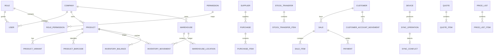

# Banco de dados

O ficheiro `stock_manager.sqlite` usa WAL, foreign keys e `busy_timeout`. O schema atual é v10, evoluído somente por migrations aditivas. Ele contém empresa/RBAC, catálogo e variantes, lotes/séries, armazéns, ledger e cache, compras/pedidos, vendas/pagamentos/crédito/devoluções, caixa/despesas, cotações, impostos/listas de preço, alertas, auditoria, backup e sincronização.

As migrations v1→v9 são aditivas e testadas preservando dados e foreign keys. O agendador cria snapshots diários verificados; restaurações criam obrigatoriamente uma cópia pré-restauro. `inventory_balances` é reconstruível por `SUM(inventory_movements.quantity_milli)` e nunca substitui o ledger.

Índices seguem consultas: nome/SKU/barcode, produto+armazém+tempo, documentos+tempo, operações pendentes e auditoria por entidade. Paginação é obrigatória para listagens.
